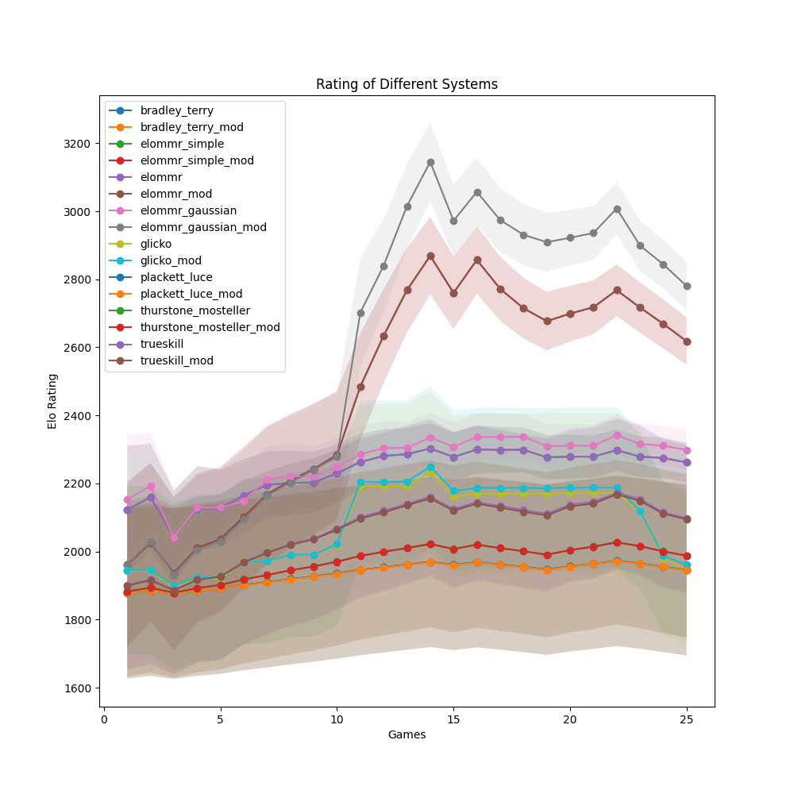
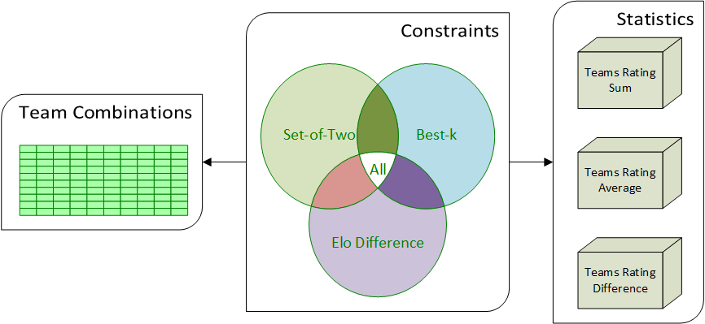
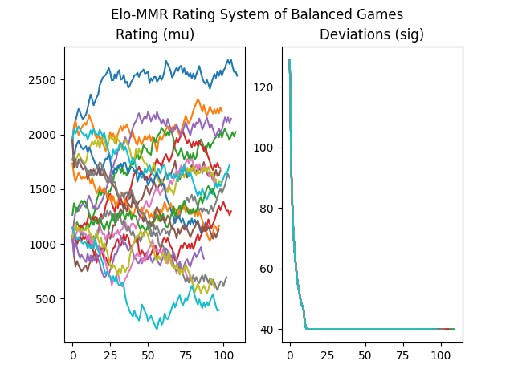
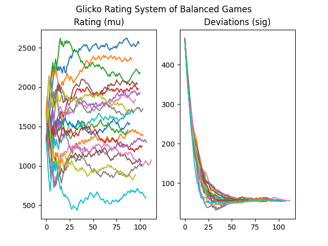
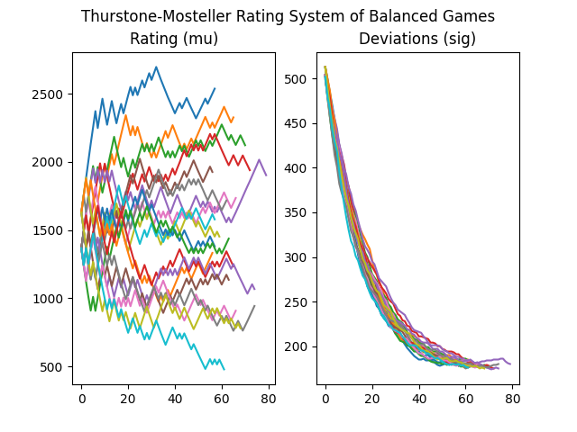
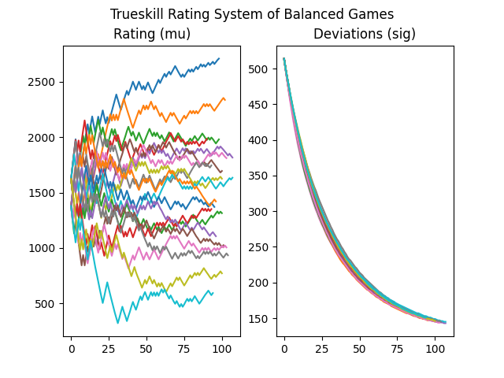
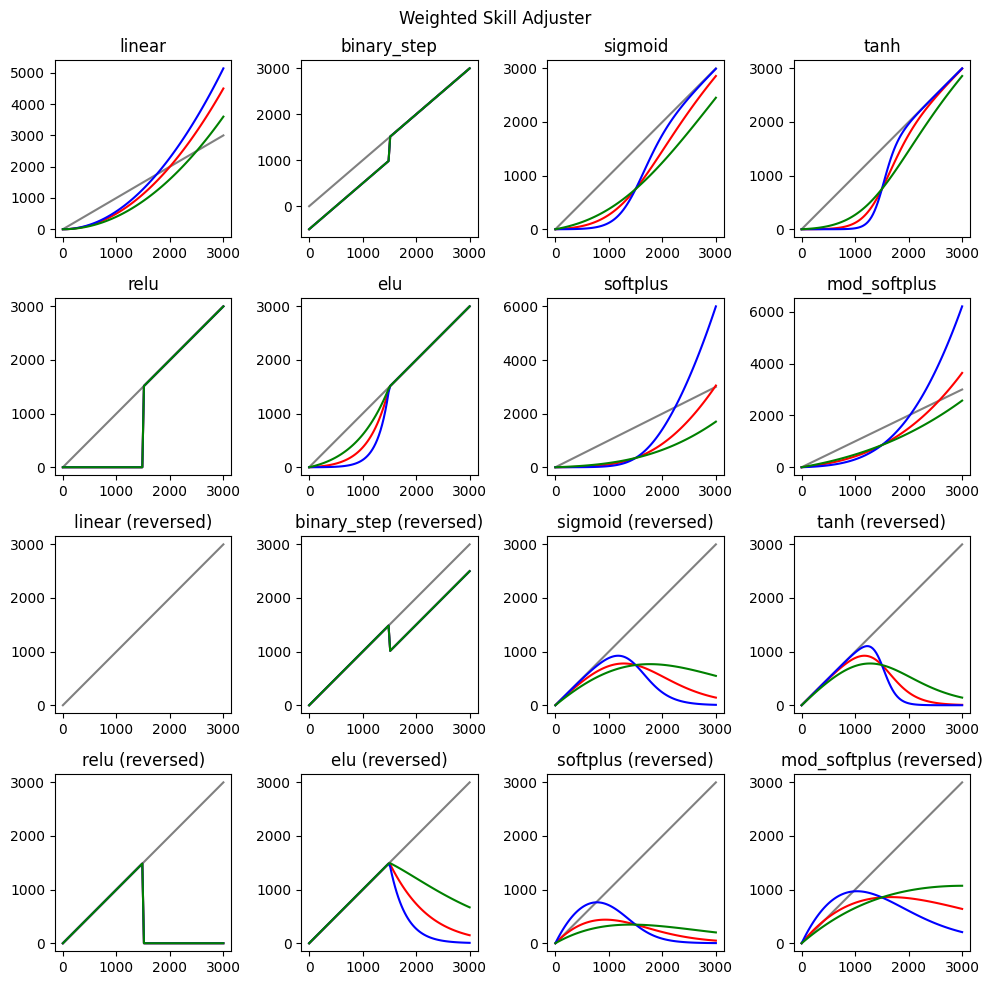

# Open-ELO (Beta Stage - v0.0.2)
A set of elo systems written in Python. Includes a balancer and team skill adjuster.  Supports multithreading for both teams and individual players.



## Installation

`pip install openelo`

## Usage

Changes in data are stored in each individual player object. To create the results of a round, create a `standings`, which is a list of tuples/lists containing players, first integer, and second integer. The integers represent differently for both individual rating system and team rating system:

`round_update` for games with individual players and `team_round_update` for team games. The `standings` are slightly different for each. 

> **Note: the individual groupings are 0-index**.
### For Individual Players

For individual players, create groupings of players that are tied. For example:
```py
#  Assuming you have references to player objects 'a', 'b', 'c', and 'd'
standings = [[a, 0, 0], [b, 1, 2], [c, 1, 2], [d, 3, 3]]
```
Shows that player `a` is first, players `b` and `c` are tied for second, and player `d` is third.

### For Teams

For team games, the format is similar, but instead of grouping based on rank, you group based on teams, where the first integer is `team` and second integer is `rank`. The rank for each team is set by the first player of a particular team:
```py
#  Assuming you have references to player objects 'a', 'b', 'c', and 'd'
standings = [[a, 0, 1], [b, 1, 2], [c, 0, 1], [d, 1, 2]]
```
Shows that `a` and `c` are on team `0` with rank `1`, and `b` and `d` are on team `1` with rank `2`.

> For simplicity, you can set the team integer to the rank integer (assuming the teams and ranks are in order).  Players with different teams and same rank are tied.  The only difference between individual players and team games is the add aggregation method.


## Full example


```py
from datetime import datetime, timezone
from operator import itemgetter
from random import sample
from statistics import mean

import numpy as np
from matplotlib import pyplot as plt
from numpy.random import logistic

from openelo import BradleyTerry, Player, ContestRatingParams, EloTeamBalancer, EloTeamBalancerParams, generate_logistic_ratings, TeamSumAggregation

# create our starting contest time (in seconds)
contest_time = round(datetime.now(timezone.utc).timestamp())

# create our rating system
bradley_terry = BradleyTerry(weight_limit=1., sig_limit=40., drift_per_day=10./7.)

contest_rating_params = ContestRatingParams(
    weight=1.,
    # perf_ceiling=3000.,
    # perf_floor=0.
    )

balancer_params = EloTeamBalancerParams(
    top_k=126,
    elo_diff=500.,
    player_balance=True,
    new_player_offset=0)
elo_team_balancer = EloTeamBalancer(settings=balancer_params)

# 20 players, 10 per game, 5 per team
num_players = 20
num_games_per_player = 100
players_per_game = 10

# we assume the skills == performance
player_true_skill = generate_logistic_ratings(num_players, 0., 3000., 1500., 500.)  # assume the skill of players
# player_true_skill = np.full(shape=(num_players,), fill_value=1500.)
player_true_skill = np.sort(player_true_skill)[::-1]  # order the skills of each player, in descending order
# player rating starts at median (1500).
player_ratings = np.array([Player.with_rating(1500., 500., update_time=0) for skill in player_true_skill], dtype=object)
imbalanced_count = 0
for w in range(num_games_per_player*num_players//(players_per_game)):
    if not w % 100:
        print(f'Completed {w}')
    #update time, assume 10 games per day
    if not w % 10:
        contest_time += (86400)
    # same our players (10-16 players total, half per team)
    idx_sample = np.array(sample(range(0, num_players), k=players_per_game))
    # pull those players
    players = player_ratings[idx_sample]
    # balance the teams
    # for each player, give them a dummy hash (this is needed because they may have the same rating)
    players_for_balancer = [(str(i), player.approx_posterior.mu) for i, player in enumerate(players)]
    elo_team_balancer.set_players(players_for_balancer)
    # indices of balanced players
    elo_info = elo_team_balancer.create_elo_info()
    if not len(elo_info['all_constraints_ind']):  # if we can't find a balanced lobby, continue
        imbalanced_count += 1
        continue

    balanced_indices = elo_info['games_combinations_ind'][elo_info['all_constraints_ind']]
    sorted_stats_ind = np.argsort(elo_info['game_statistics'][elo_info['all_constraints_ind']][:, 5])
    sorted_balanced_indices = balanced_indices[sorted_stats_ind]
    best_game_indices = sorted_balanced_indices[0]

    player_skills = np.array([skill for skill in player_true_skill[idx_sample]])
    sorted_ratings = np.argsort(player_skills)[::-1]
    outer_indices = idx_sample[sorted_ratings]

    # comment/uncomment these to test out different indices (balanced teams, stacked teams, and balanced teams)
    outer_indices0, outer_indices1 = idx_sample[best_game_indices[0]], idx_sample[best_game_indices[1]]  # BALANCED TEAMS
    # outer_indices0, outer_indices1 = idx_sample[0:5], idx_sample[5:10]  # RANDOM TEAMS
    # outer_indices0, outer_indices1 = outer_indices[0:5], outer_indices[5:10]  # STACKED TEAMS

    # choose 10 players, 5 for each team
    team1, team2 = player_ratings[outer_indices0], player_ratings[outer_indices1]
    # we get the priors for each teammate, thus assuming their performance order.
    inter_team_perf1, inter_team_perf2 = np.array([player.approx_posterior.mu for player in team1]), np.array([player.approx_posterior.mu for player in team2])
    # get the indices of each teammate based on priors
    inter_team1_idx = np.argsort(inter_team_perf1)[::-1]
    inter_team2_idx = np.argsort(inter_team_perf2)[::-1]
    # get the true skill of each teammate for simulated win/loss
    team1_true_skill_sum, team2_true_skill_sum = np.sum(logistic(player_true_skill[outer_indices0], 80.)), np.sum(logistic(player_true_skill[outer_indices1], 80.))
    # simulate teams winning based on the sum of the performances

    if team1_true_skill_sum > team2_true_skill_sum:
        # order the players in each team based on random performances
        standings = [(player, 1, 1) for i, player in enumerate(team1[inter_team1_idx])] + [(player, 2, 2) for i, player in enumerate(team2[inter_team2_idx])]
    else:
        standings = [(player, 1, 1) for i, player in enumerate(team2[inter_team2_idx])] + [(player, 2, 2) for i, player in enumerate(team1[inter_team1_idx])]

    bradley_terry.team_round_update(contest_rating_params, standings, TeamSumAggregation(), contest_time=contest_time)


# print the game results
player_name_rating = list((player, rating.approx_posterior.mu) for player, rating in enumerate(player_ratings))
player_name_rating.sort(key=itemgetter(1))
print(f'MEAN: {mean([x for _, x in player_name_rating])}')

best_player = player_ratings[0]
for event in best_player.event_history:
    print(f"{event.rating_mu}, {event.rating_sig}, {event.perf_score}, {event.place}")
print('DIFFERENCE OF COMPUTED SKILL AND THEORETICAL SKILL: ', np.sum(np.abs(player_true_skill - np.array([rating.approx_posterior.mu for rating in player_ratings]))))
print(f'GAMES IMBALANCED PERCENT: {imbalanced_count / (num_games_per_player*num_players) * 100}%')

fig, axes = plt.subplots(1, 2)
fig.suptitle('Bradley-Terry Rating System of Balanced Games')

for i, player in enumerate(player_ratings):
    axes[0].plot([history.rating_mu for history in player.event_history])
    axes[0].set_title('Rating (mu)')
    axes[1].plot([history.rating_sig for history in player.event_history])
    axes[1].set_title('Deviations (sig)')

plt.show()
```


## Elo Systems
- Bradley-Terry (https://jmlr.csail.mit.edu/papers/volume12/weng11a/weng11a.pdf)
- CodeForce (https://codeforces.com/blog/entry/102)
- Elo (https://en.wikipedia.org/wiki/Elo_rating_system)
- Endure Elo (https://www-users.york.ac.uk/~bp787/Generalizing_Elo_arxiv.pdf)
- Trueskill (https://www.microsoft.com/en-us/research/uploads/prod/2018/03/trueskill2.pdf)
- Glicko (http://glicko.net/glicko/glicko.pdf)
- Plackett-Luce (https://jmlr.csail.mit.edu/papers/volume12/weng11a/weng11a.pdf)
- Thurstone-Mosteller (https://jmlr.csail.mit.edu/papers/volume12/weng11a/weng11a.pdf)
- TopCoder (https://www.topcoder.com/community/competitive-programming/how-to-compete/ratings)


## Single and Team Rating Systems

### Individual Player Rating Systems
- Codeforce
- Elo
- Elo-MMR (simple and non-simple)
- EndureElo
- Glicko
- Topcoder

### Team Rating Systems
- Bradley-Terry (with partial)
- Elo
- Elo-MMR (simple and non-simple)
- Trueskill
- Glicko
- Plackett-Luce
- Thurstone-Mosteller (with partial)

## Rating Systems Features
- Contest Weights
- Min/Max Performances
- Team Skill Aggregations
    - Sum
    - Average
    - Min
    - Max
    - Top N/Lowest N players
- Variants
    - Logistic
    - Gaussian
- Partial Team Ratings
- Player History Events
- Robust Average
- Weight Limit
- Noob Delay (reduce the weight of individual players)
- Sigma limit (increase deviations of player ratings)
- Drifts per day (brownian effect based on time)

## Balancer Features
- Team Combinations
- Constraints
    - Set of Two Balance constraint (best two players must be on opposing teams, next two best players must be on opposing teams, etc...)
    - Rating difference constraint (based on absolute value)
    - Top K teams constraint
    - Combined All constraints (intersection of all constraints)
- Statistics
    - Sum
    - Average
    - Difference
    - Absolute Value
- Best game
- Team skill adjuster (adjusts the skill of each player according to an activation function, i.e., scale higher skilled players higher).



## Required Libraries
- Python 12.0+
- Numpy
- Scipy
- nptyping
- trueskill

## Graphs of Balanced Games (20 players, 10 players per game)
> 20 players start with a rating of 1500 (mu) and a deviation of 500 (sigma). 20 players were also given a *true skill* level from a normal distribution from 0 (worst) to 3000 (best). 10 players were randomly chosen for each game. The players for each team (2 teams) are chosen from the balancer based on *rating*.  Outcome of game is based on the sum of their *performance* (*true skill* with a logistic noise).  Therefore, the rating of the players should eventually converge to their true skill.

### Bradley-Terry


### Elo-MMR


### Glicko


### Plackett-Luce


### Thurstone-Mosteller


### Trueskill


# Aggregation

Numerous aggregation methods have been created for your own needs. For example, if the best player has the highest determining factor of the teams performance, then the `max` aggregation might be more suitable for the domain. The most common aggregation for teams is the summation aggregation of ratings and deviations:

## Summation (sum of all players rating is team rating)
$$ \mu_\tau = \sum_{i \in \tau}{\mu_i}, \space \sigma^2_{\tau} = \sum_{i \in \tau}{\sigma^2_i} $$

## Average (average rating of players is team rating)

$$ \mu_\tau = \frac{\sum_{i \in \tau}{\mu_i}}{|\tau|}, \space \sigma^2_{\tau} = \frac{\sum_{i \in \tau}{\sigma^2_i}}{|\tau|}  $$

## Maximum (best player rating is the team rating)

$$ \mu_\tau = \mathrm{max}({\mu_i, \mu_{i+1}, ..., \mu_{n}}), \space \sigma^2_{\tau} = \mathrm{max}({\sigma^2_i, \sigma^2_{i+1}, ..., \sigma^2_{n}})  $$

## Minimum (worst player rating is the team rating)

$$ \mu_\tau = \mathrm{min}({\mu_i, \mu_{i+1}, ..., \mu_{n}}), \space \sigma^2_{\tau} = \mathrm{min}({\sigma^2_i, \sigma^2_{i+1}, ..., \sigma^2_{n}})  $$

## N-Summation (sum of n best/worst players is team rating)

Same as above, except it is the best/worst n players.

## N-Average (average of n best/worst players is team rating)

Same as above, except it is the best/worst n players.


# Weighted Skill Adjuster

Sometimes a domain is more heavily weighed by player skills.  The weighted skill adjuster adjusts the skill of the team by adjusting the skill of the player.

> Can be used with the balancer to balance teams for the domain.



# TODO:

- Glicko 2
- Trueskill 2