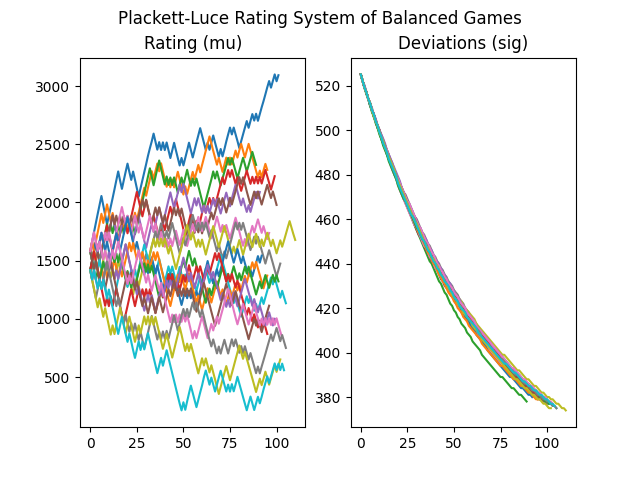

# Open-ELO
A set of elo systems written in Python. Includes a balancer and team skill adjuster.  Supports multithreading for both teams and individual players.


## Usage

Changes in data are stored in each individual player object.

`round_update` for games with individual players and `team_round_update` for team games. The `standings` are slightly different for each. 

### For Individual Players

For individual players, create groupings of players that are tied. For example:
```py
#  Asumming you have references to player objects 'a', 'b', 'c', and 'd'
standings = [[a, 0, 0], [b, 1, 2], [c, 1, 2], [d, 3, 3]]
```
Shows that player `a` is first, players `b` and `c` are tied for second, and player `d` is third.

### For Teams

For team games, the format is similar, but instead of grouping based on rank, you group based on teams, where the first integer is `team` and second integer is `rank`. The rank for each team is set by the first player of a particular team:
```py
#  Asumming you have references to player objects 'a', 'b', 'c', and 'd'
standings = [[a, 0, 1], [b, 1, 2], [c, 0, 1], [d, 1, 2]]
```
Shows that `a` and `c` are on team `0` with rank `1`, and `b` and `d` are on team `1` with rank `2`.

For simplicity, you can set the team integer to the rank integer (assuming the teams and ranks match).  Players with different teams and same rank are tied.  The only difference between individual players and team games is the add aggregation method.


## Elo Systems
- Bradley-Terry (https://jmlr.csail.mit.edu/papers/volume12/weng11a/weng11a.pdf)
- CodeForce (https://codeforces.com/blog/entry/102)
- Elo (https://en.wikipedia.org/wiki/Elo_rating_system)
- Endure Elo (https://www-users.york.ac.uk/~bp787/Generalizing_Elo_arxiv.pdf)
- Trueskill (https://www.microsoft.com/en-us/research/uploads/prod/2018/03/trueskill2.pdf)
- Glicko (http://glicko.net/glicko/glicko.pdf)
- Plackett-Luce (https://jmlr.csail.mit.edu/papers/volume12/weng11a/weng11a.pdf)
- Thurstone-Mosteller (https://jmlr.csail.mit.edu/papers/volume12/weng11a/weng11a.pdf)
- TopCoder (https://www.topcoder.com/community/competitive-programming/how-to-compete/ratings)


## Single and Team Rating Systems

### Individual Player Rating Systems
- Codeforce
- Elo
- Elo-MMR (simple and non-simple)
- EndureElo
- Glicko
- Topcoder

### Team Rating Systems
- Bradley-Terry (with partial)
- Elo
- Elo-MMR (simple and non-simple)
- Trueskill
- Glicko
- Plackett-Luce
- Thurstone-Mosteller (with partial)

## Rating Systems Features
- Contest Weights
- Min/Max Performances
- Team Skill Aggregations
    - Sum
    - Average
    - Min
    - Max
    - Top N/Lowest N players
- Variants
    - Logistic
    - Gaussian
- Partial Team Ratings
- Player History Events
- Robust Average
- Weight Limit
- Noob Delay (reduce the weight of individual players)
- Sigma limit (increase deviations of player ratings)
- Drifts per day (brownian effect based on time)

## Balancer Features
- Team Combinations
- Constraints
    - Set of Two Balance constraint (best two players must be on opposing teams, next two best players must be on opposing teams, etc...)
    - Rating difference constraint (based on absolute value)
    - Top K teams constraint
    - Combined All constraints (intersection of all constraints)
- Statistics
    - Sum
    - Average
    - Difference
    - Absolute Value
- Best game
- Team skill adjuster (adjusts the skill of each player according to an activation function, i.e., scale higher skilled players higher).


## Required Libraries
- Python 12.0+
- Numpy
- Scipy
- nptyping
- trueskill

## Graphs of Balanced Games (20 players, 10 players per game)
> 20 players start with a rating of 1500 (mu) and a deviation of 500 (sigma). 20 players were also given a *true skill* level from a normal distribution from 0 (worst) to 3000 (best). 10 players were randomly chosen for each game. The players for each team (2 teams) are chosen from the balancer based on *rating*.  Outcome of game is based on the sum of their *performance* (*true skill* with a logistic noise).  Therefore, the rating of the players should eventually converge to their true skill.

### Bradley-Terry


### Elo-MMR


### Glicko


### Plackett-Luce


### Thurstone-Mosteller


### Trueskill


# Aggregation

Numerous aggregation methods have been created for your own needs. For example, if the best player has the highest determining factor of the teams performance, then the `max` aggregation might be more suitable for the domain. The most common aggregation for teams is the summation aggregation of ratings and deviations:

## Summation (sum of all players rating is team rating)
$$ \mu_\tau = \sum_{i \in \tau}{\mu_i}, \space \sigma^2_{\tau} = \sum_{i \in \tau}{\sigma^2_i} $$

## Average (average rating of players is team rating)

$$ \mu_\tau = \frac{\sum_{i \in \tau}{\mu_i}}{|\tau|}, \space \sigma^2_{\tau} = \frac{\sum_{i \in \tau}{\sigma^2_i}}{|\tau|}  $$

## Maximum (best player rating is the team rating)

$$ \mu_\tau = \mathrm{max}({\mu_i, \mu_{i+1}, ..., \mu_{n}}), \space \sigma^2_{\tau} = \mathrm{max}({\sigma^2_i, \sigma^2_{i+1}, ..., \sigma^2_{n}})  $$

## Minimum (worst player rating is the team rating)

$$ \mu_\tau = \mathrm{min}({\mu_i, \mu_{i+1}, ..., \mu_{n}}), \space \sigma^2_{\tau} = \mathrm{min}({\sigma^2_i, \sigma^2_{i+1}, ..., \sigma^2_{n}})  $$

## N-Summation (sum of n best/worst players is team rating)

Same as above, except it is the best/worst n players.

## N-Average (average of n best/worst players is team rating)

Same as above, except it is the best/worst n players.


# Weighted Skill Adjuster

Sometimes a domain is more heavily weighed by player skills.  The weighted skill adjuster adjusts the skill of the team by adjusting the skill of the player.

> Can be used with the balancer to balance teams for the domain.

