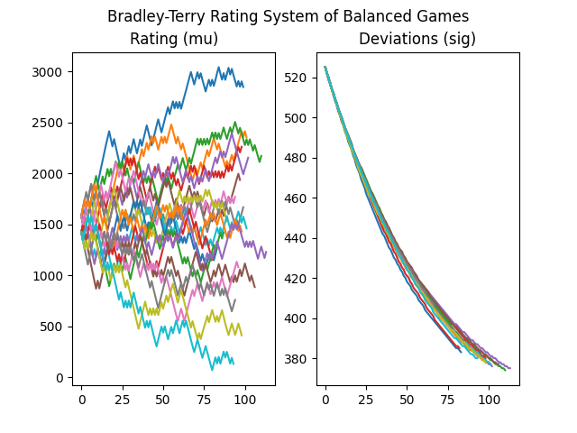

# Open-ELO
A set of elo systems written in Python. Includes a balancer.

## Elo Systems
- Bradley-Terry (https://jmlr.csail.mit.edu/papers/volume12/weng11a/weng11a.pdf)
- CodeForce (https://codeforces.com/blog/entry/102)
- Elo (https://en.wikipedia.org/wiki/Elo_rating_system)
- Endure Elo (https://www-users.york.ac.uk/~bp787/Generalizing_Elo_arxiv.pdf)
- Trueskill (https://www.microsoft.com/en-us/research/uploads/prod/2018/03/trueskill2.pdf)
- Glicko (http://glicko.net/glicko/glicko.pdf)
- Plackett-Luce (https://jmlr.csail.mit.edu/papers/volume12/weng11a/weng11a.pdf)
- Thurstone-Mosteller (https://jmlr.csail.mit.edu/papers/volume12/weng11a/weng11a.pdf)
- TopCoder (https://www.topcoder.com/community/competitive-programming/how-to-compete/ratings)

## Single and Team Rating Systems

### Individual Player Rating Systems
- Codeforce
- Elo
- Elo-MMR (simple and non-simple)
- EndureElo
- Glicko
- Topcoder

### Team Rating Systems
- Bradley-Terry (with partial)
- Elo
- Elo-MMR (simple and non-simple)
- Trueskill
- Glicko
- Plackett-Luce
- Thurstone-Mosteller (with partial)

## Rating Systems Features
- Contest Weights
- Min/Max Performances
- Team Skill Aggregations
    - Sum
    - Average
    - Min
    - Max
    - Top N/Lowest N players
- Variants
    - Logistic
    - Gaussian
- Partial Team Ratings
- Player History Events
- Robust Average
- Weight Limit
- Noob Delay (reduce the weight of individual players)
- Sigma limit (increase deviations of player ratings)
- Drifts per day (brownian effect based on time)

## Balancer Features
- Team Combinations
- Constraints
    - Set of Two Balance constraint (best two players must be on opposing teams, next two best players must be on opposing teams, etc...)
    - Rating difference constraint (based on absolute value)
    - Top K teams constraint
    - Combined All constraints (intersection of all constraints)
- Statistics
    - Sum
    - Average
    - Difference
    - Absolute Value
- Best game

## Required Libraries
- Python 12.0+
- Numpy
- Scipy
- nptyping
- trueskill

## Graphs of Balanced Games (20 players, 10 players per game)
> 20 players start with a rating of 1500 (mu) and a deviation of 500 (sigma). 20 players were also given a *true skill* level from a normal distribution from 0 (worst) to 3000 (best). 10 players were randomly chosen for each game. The players for each team (2 teams) are chosen from the balancer based on *rating*.  Outcome of game is based on the sum of their *performance* (*true skill* with a logistic noise).  Therefore, the rating of the players should eventually converge to their true skill.

### Bradley-Terry

### Elo-MMR

### Glicko

### Plackett-Luce

### Thurstone-Mosteller

### Trueskill

